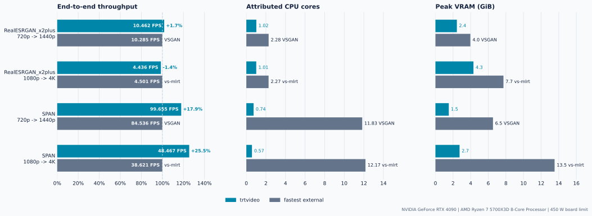
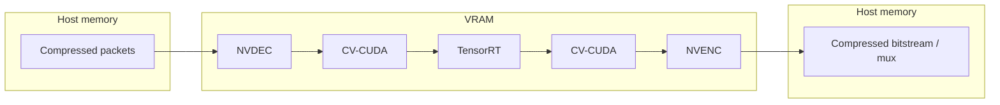
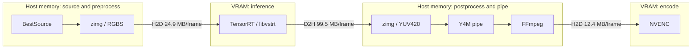

# trtvideo

[](https://github.com/egor-fedorov/trtvideo/actions/workflows/ci.yml)
[](https://github.com/egor-fedorov/trtvideo/actions/workflows/docker-build.yml)
[](https://github.com/egor-fedorov/trtvideo/releases/latest)
[](LICENSE)

GPU-resident TensorRT video upscaling from compressed input to muxed output in
one Docker command. Raw video frames stay on the GPU through NVDEC, CV-CUDA,
TensorRT, and NVENC.

https://github.com/user-attachments/assets/826e16e7-754d-4e27-8094-cb86cbfaf0c6

*Illustrative 2x detail crop from the pinned demo. Left: the 720p input
scaled with Lanczos. Right: `trtvideo` with `RealESRGAN_x2plus`. Both sides
use identical frames and final encoding. Source:
["Jacqueville beach in may 2026 (0)"](https://commons.wikimedia.org/wiki/File:Jacqueville_beach_in_may_2026_(0).webm)
by Poro26, CC BY-SA 4.0. The comparison is silent.*

## Contents

- [Measured Throughput And Resource Use](#measured-throughput-and-resource-use)
- [Quick Start](#quick-start)
- [Architecture](#architecture)
- [Scope And Alternatives](#scope-and-alternatives)
- [Documentation](#documentation)
- [Host Requirements](#host-requirements)
- [Build The Image](#build-the-image)
- [Environment Check](#environment-check)
- [Demo Details](#demo-details)
- [Models](#models)
- [Docker Workflow](#docker-workflow)
- [CLI Reference](#cli-reference)
- [Encoding](#encoding)
- [Media Contract](#media-contract)
- [Quality Checks](#quality-checks)
- [License](#license)

## Measured Throughput And Resource Use

Across independent validated RTX 3090 and RTX 4090 sessions, RealESRGAN stays
within 3.3% of the fastest tuned external result. SPAN ranges from parity on RTX
3090 to `trtvideo` advantages of 17.9% and 25.5% on RTX 4090. The fastest
external implementation uses 2.1-21.2x as much attributed CPU and 1.6-4.9x as
much peak VRAM.

### RTX 4090

| Workload | End-to-end FPS (trtvideo / fastest external) | CPU cores (trtvideo / external) | Peak VRAM (trtvideo / external) |
|---|---:|---:|---:|
| RealESRGAN_x2plus 720p -> 1440p | 10.462 / 10.285 VSGAN (+1.7%) | 1.02 / 2.28 | 2.43 / 3.96 GiB |
| RealESRGAN_x2plus 1080p -> 4K | 4.436 / 4.501 vs-mlrt (-1.4%) | 1.01 / 2.27 | 4.32 / 7.72 GiB |
| SPAN 720p -> 1440p | 99.655 / 84.536 VSGAN (+17.9%) | 0.74 / 11.83 | 1.52 / 6.53 GiB |
| SPAN 1080p -> 4K | 48.467 / 38.621 vs-mlrt (+25.5%) | 0.57 / 12.17 | 2.74 / 13.53 GiB |

These end-to-end measurements use an RTX 4090 at its stock 450 W board limit
with a Ryzen 7 5700X3D. RealESRGAN is inside the predeclared +/-5% parity band;
both SPAN rows are confirmed speed advantages.

<picture>
  <source media="(prefers-color-scheme: dark)" srcset="benchmarks/results/rtx-4090/figures/throughput-resources-dark.svg">
  
</picture>

Each row normalizes the fastest external result to 100% while retaining the
measured FPS in each bar; CPU and VRAM use linear absolute scales.

Source: the privacy-reviewed [RTX 4090 tuned result](benchmarks/results/rtx-4090/tuned.json),
measured on 2026-08-18 from revision `fdd59dd`. See the
[full RTX 4090 report](benchmarks/results/rtx-4090/README.md) and
[benchmark methodology](benchmarks/methodology.md) for complete provenance,
quality gates, and the tuning contract.

<details>
<summary><strong>RTX 3090 independent replication</strong></summary>

| Workload | End-to-end FPS (trtvideo / fastest external) | CPU cores (trtvideo / external) | Peak VRAM (trtvideo / external) |
|---|---:|---:|---:|
| RealESRGAN_x2plus 720p -> 1440p | 6.140 / 6.345 VSGAN (-3.2%) | 1.01 / 2.17 | 2.18 / 3.67 GiB |
| RealESRGAN_x2plus 1080p -> 4K | 2.803 / 2.830 vs-mlrt (-0.9%) | 1.01 / 2.17 | 4.17 / 7.45 GiB |
| SPAN 720p -> 1440p | 55.760 / 55.226 vs-mlrt (+1.0%) | 0.56 / 5.88 | 1.37 / 3.84 GiB |
| SPAN 1080p -> 4K | 26.097 / 25.268 vs-mlrt (+3.3%) | 0.47 / 8.14 | 2.59 / 11.48 GiB |

The RTX 3090 session used a 350 W board limit and Ryzen 5 5600. All four rows
are inside the same +/-5% parity band. See the
[full RTX 3090 report](benchmarks/results/rtx-3090/README.md).

</details>

## Quick Start

On a Linux host with an NVIDIA driver, Docker, and working
`docker run --gpus all` passthrough, pull the published production image:

```bash
docker pull ghcr.io/egor-fedorov/trtvideo:latest
```

Process a video with a prepared static TensorRT engine:

```bash
docker run --rm --gpus all \
  --user "$(id -u):$(id -g)" \
  -v "$PWD:/work" \
  --workdir /work \
  ghcr.io/egor-fedorov/trtvideo:latest trtvideo \
  --engine model.engine \
  --input input.mp4 \
  --output output.mp4
```

Use a version tag instead of `latest` for reproducible deployments. TensorRT
engines are GPU- and runtime-specific, so they are not bundled in the image.

If you do not have a prepared model and engine, run the self-contained demo:

```bash
git clone https://github.com/egor-fedorov/trtvideo.git
cd trtvideo
make demo
```

The demo builds the model-tools image and a GPU-specific TensorRT engine,
processes a five-second CC BY-SA live-action excerpt, validates the complete
result, and writes `.demo/output/demo_1440p.mp4`. See the
[Docker workflow](#docker-workflow) to prepare a model and process your own
video.

## Architecture

### trtvideo GPU-Resident Path



### VapourSynth Benchmark Path (As Measured)



The transfer labels are computed payload sizes for the declared FP32 RGBS and
YUV420 contracts at 1080p -> 4K. A measured SPAN 1080p Nsight trace found no
H2D or D2H copy in the `trtvideo` frame loop. Only compressed input and output
cross its host/device boundary.

## Scope And Alternatives

`trtvideo` deliberately optimizes one narrow contract: headless, file-to-file,
full-frame TensorRT video processing in Docker with explicit model, media, and
validation contracts. Choose it when all of the following matter:

- an explicit ONNX/TensorRT model instead of a packaged model catalog;
- repeatable batch or service execution from a headless Docker container;
- an NVIDIA-only path that keeps raw frames on the GPU from decode through
  learned inference and encode;
- auditable model, media-preservation, output-quality, and benchmark evidence.

If the priority is a GUI, cross-vendor execution, a general processing graph,
or streaming analytics, one of the broader tools below is a better fit. These
are scope boundaries, not unmeasured performance rankings.

### NVIDIA DeepStream

[DeepStream](https://docs.nvidia.com/metropolis/deepstream/dev-guide/text/DS_Overview.html)
is a GStreamer-based SDK for GPU-accelerated streaming analytics and TensorRT
inference. Choose it for multi-stream ingestion, analytics metadata, or a larger
streaming application. `trtvideo` provides a smaller ready-made path when one
full-frame model transforms a video file and the surrounding media must be
preserved.

**Benchmark status:** not included because the harness has no pinned DeepStream
pipeline implementing the same file-to-file model and media contract.

### Video2X

[Video2X](https://github.com/k4yt3x/video2x) is a cross-platform upscaling and
frame-interpolation application with packaged Real-ESRGAN, Real-CUGAN, and RIFE
paths through ncnn and Vulkan. Choose it for a GUI, a cross-platform Vulkan
workflow, or its packaged model set. `trtvideo` instead accepts an explicit
static TensorRT engine and trades that generality for a reproducible NVIDIA-only
runtime contract.

**Benchmark status:** excluded from the current same-model matrix. Video2X 6.4.0
supplies the non-anime
[`realesrgan-plus` model at x4](https://github.com/k4yt3x/video2x/tree/6.4.0/models/realesrgan),
whereas this matrix uses the canonical
`RealESRGAN_x2plus` checkpoint at x2. A future cross-backend comparison can
convert those exact x2 weights to ncnn, but the artifact must first pass the
same model-space and product-output gates. The current exclusion is not an
assumption that Video2X is slower or lower quality.

### chaiNNer

[chaiNNer](https://chainner.app/) is a visual node editor for composing image
processing chains across PyTorch, NCNN, ONNX, and TensorRT, including iteration
over video frames. Choose it for model exploration and custom interactive
workflows. `trtvideo` is the narrower headless runtime for repeatedly executing
one validated video pipeline from the command line or another service.

**Benchmark status:** not included because the harness has no pinned chaiNNer
graph implementing the canonical model and media contract.

### FFmpeg With NVIDIA Acceleration

[FFmpeg with NVDEC, CUDA filters, and NVENC](https://docs.nvidia.com/video-technologies/video-codec-sdk/13.1/ffmpeg-with-nvidia-gpu/index.html)
can keep conventional decode, resize, colorspace conversion, and encode work on
the GPU. Use it directly when learned inference is not required. `trtvideo`
adds an explicit full-frame TensorRT model between decode and encode, while
still delegating concurrent muxing and media preservation to FFmpeg.

**Benchmark status:** not included because the documented NVDEC/CUDA/NVENC path
has no equivalent learned-model stage; its FPS would measure transcoding rather
than the declared inference workload.

### VapourSynth And DGDecNV

VapourSynth remains a strong choice for scriptable filtering and a broad plugin
ecosystem. DGDecNV can provide NVDEC source decoding on Windows through an
AviSynth compatibility layer, but it is not part of the pinned Linux workflows
and does not remove the host-memory boundaries around `libvstrt`.

**Benchmark status:** included through the pinned vs-mlrt and VSGAN paths. The
exact measured configuration and transfer rationale are documented in the
[architecture guide](docs/ARCHITECTURE.md#vapoursynth-benchmark-path-as-measured)
and [benchmark methodology](benchmarks/methodology.md#purpose).

## Documentation

- [Architecture](docs/ARCHITECTURE.md) - inference, TensorRT runtime, and video
  pipeline architecture.
- [Model Contract](docs/MODEL_CONTRACT.md) - supported tensor contract, model
  preparation paths, conformance checks, and compatibility reporting.
- [Testing](docs/TESTING.md) - test layers and the Docker-only quality gate.
- [Contributing](CONTRIBUTING.md) - development workflow and pull-request
  expectations.
- [Security](SECURITY.md) - supported revisions and private vulnerability
  reporting.
- [Licensing](docs/LICENSING.md) - distribution boundary and audited release
  inventory.
- [Third-Party Notices](THIRD_PARTY_NOTICES.md) - licenses and terms retained by
  container dependencies.
- [Roadmap](docs/ROADMAP.md) - current development directions.
- [Changes](docs/CHANGES.md) - versioned changes and versioning rules.
- [Performance Log](docs/PERFORMANCE_LOG.md) - measured performance changes.
- [Benchmark Methodology](benchmarks/methodology.md) - workloads and comparison
  rules.
- [Benchmark Results](benchmarks/results/README.md) - publication status and
  privacy-reviewed result snapshots when available.

## Host Requirements

GPU runs require a host with the following components already configured:

- an NVIDIA driver;
- Docker;
- GPU passthrough for `docker run --gpus all`.

## Build The Image

Build the production image used for engine compilation and video processing:

```bash
make build
```

The default production image is `trtvideo:latest`. It contains video processing,
static-ONNX compatibility, input preparation/reporting, and `build-engine`, but
not PyTorch or model conversion tools. Use
`make build IMAGE=example/name:tag` to select another name.

Model export, dynamic ONNX preparation, checkpoint compatibility checks, and
the self-contained demo use a separate image:

```bash
make build-model-tools
```

That target writes `trtvideo:model-tools` by default. Versioned GitHub releases
publish the narrow production image as `ghcr.io/egor-fedorov/trtvideo` and the
conversion toolchain as `ghcr.io/egor-fedorov/trtvideo-model-tools`. Each image
has its own immutable digest, SBOM, build provenance, and signed attestation.
Benchmark images are not published.

The image sets `NVIDIA_DRIVER_CAPABILITIES=compute,utility,video`, which is
required for NVDEC/NVENC through PyNvVideoCodec. Containers run with
`--gpus all`.

## Environment Check

After building the production image, verify the static runtime environment
before preparing a model or processing a video:

```bash
docker run --rm --gpus all \
  --user "$(id -u):$(id -g)" \
  -v "$PWD:/app" \
  trtvideo:latest trtvideo doctor
```

The command actively initializes CUDA, TensorRT, and a minimal CV-CUDA device
allocation. It also checks Docker execution, the NVIDIA driver, the selected
GPU, NVDEC/NVENC driver entry points, PyNvVideoCodec, available VRAM, and free
space plus write access on the selected filesystem. Use `--gpu-id` and
`--disk-path` when the defaults do not describe the intended run.

`doctor` answers whether the static runtime prerequisites are usable. It does
not validate a model-specific TensorRT engine, input codec, required VRAM, or
throughput; those remain workload-dependent and require a short processing
smoke test.

Build the development image with Ruff and mypy:

```bash
make build-dev
```

Use `make format` to apply Ruff import sorting and Black-compatible
formatting. CI runs the read-only formatting check as part of `make lint`.

## Demo Details

The target builds the local model-tools image, downloads the pinned
`RealESRGAN_x2plus` v0.2.1 weights and the 20.1 MB Wikimedia original
[`Jacqueville beach in may 2026 (0)`](https://commons.wikimedia.org/wiki/File:Jacqueville_beach_in_may_2026_(0).webm)
by Poro26 under CC BY-SA 4.0. It verifies both assets by size and SHA256, then
prepares a five-second, 120-frame excerpt with audible surf. It exports only
the 720p ONNX, converts it to mixed FP16, builds a TensorRT engine on the
current GPU, runs the `nvcodec` pipeline, and fully validates the 1440p output.
The browser-friendly MP4 uses high-bitrate AAC to avoid audible degradation
when transcoding the source Opus track.

Verified assets are cached under the ignored `.demo/` directory. The final
video and machine-readable validation report are:

```text
.demo/output/demo_1440p.mp4
.demo/demo-result.json
```

Use another GPU index or rebuild generated assets explicitly:

```bash
make demo DEMO_GPU_ID=1
make demo DEMO_FORCE=1
```

Remove the complete cache with `make demo-clean`. The validation report records
the model and video URLs, immutable hashes, attribution, licenses, selected
source interval, processed assets, and relative input/output chroma retention.
The prepared input cache is bound to the source hash and complete FFmpeg command,
so source or preparation changes cannot silently reuse an older clip.
The prepared and enhanced videos remain CC BY-SA 4.0 adaptations; attribution,
license, and modification details are also embedded in their MP4 metadata.

## Models

### Compatibility Matrix

| Model | Task | Scale | Status | Evidence |
|---|---|---:|---|---|
| `RealESRGAN_x2plus` | Super-resolution | 2x | `validated` | [RTX 3090](benchmarks/results/rtx-3090/README.md#quality-gates), [RTX 4090](benchmarks/results/rtx-4090/README.md#quality-gates) |
| `2xLiveActionV1_SPAN` | Super-resolution | 2x | `validated` | [RTX 3090](benchmarks/results/rtx-3090/README.md#quality-gates), [RTX 4090](benchmarks/results/rtx-4090/README.md#quality-gates) |

Statuses describe evidence, not an architectural allowlist:

- `validated` - a published benchmark run passed the shared-input inference and
  product-output quality gates;
- `community-reported` - a reproducible public compatibility issue records a
  successful run, but the model has not passed the publication protocol;
- `untested` - no accepted compatibility evidence exists yet.

There are deliberately no `planned` rows. To test another model, follow the
[model contract](docs/MODEL_CONTRACT.md) and submit the
[model compatibility report](https://github.com/egor-fedorov/trtvideo/issues/new?template=model_compatibility.yml).
A reviewed successful report receives the `community-reported` label, after
which the maintainer adds the matrix row with the issue as evidence. The
reporter does not need to open a second pull request. Only published quality-
gated evidence can promote the model to `validated`.

### Check Another Model

The model-tools image turns a Spandrel-compatible checkpoint into a complete,
issue-ready compatibility bundle in one command. It downloads and verifies the
pinned CC BY-SA live-action fixture, exports and checks ONNX, builds a
GPU-specific engine, processes 120 frames, fully validates the result, and
retains every intermediate under the selected output directory:

```bash
IMAGE=ghcr.io/egor-fedorov/trtvideo-model-tools:vX.Y.Z

docker pull "$IMAGE"
docker run --rm --gpus all \
  --user "$(id -u):$(id -g)" \
  -e HOME=/tmp \
  -v "$PWD:/work" \
  --workdir /work \
  "$IMAGE" trtvideo compatibility-check \
  --checkpoint BSRGANx2.pth \
  --model-name BSRGANx2 \
  --model-source https://openmodeldb.info/models/2x-BSRGAN \
  --model-license Apache-2.0 \
  --output-dir compatibility-report
```

`/work` is deliberately the container working directory and all CLI paths are
relative to it. They therefore resolve from the host directory where Docker was
started as well: terminal artifact paths and `commands.txt` remain usable after
the container exits.

Replace `vX.Y.Z` with an immutable release tag; do not use `latest` for
submitted evidence. A run normally takes 10-30 minutes depending on the model
and GPU. Progress names every low-level command and emits an elapsed-time
heartbeat every 30 seconds. Use `--dry-run` to inspect the plan without creating
files or touching the GPU, and `--resume` after an interruption. Completed
steps are reused only while their hashes and the source/image/GPU context still
match. If final validation rejects the model, its diagnostic JSON and Markdown
remain available; `--resume` retries that unsuccessful tail without rebuilding
verified artifacts.

Pass `--onnx model.onnx` instead of `--checkpoint` to start from ONNX.
Static ONNX determines the fixture resolution and goes directly to engine
compilation, so this route also works in the narrower production image. Dynamic
ONNX is made static first in model-tools and needs `--scale N` unless the graph
carries trustworthy scale metadata. `--input sample.mp4` replaces the
pinned fixture with SDR BT.709 user material and preserves its input resolution.
HDR and non-BT.709 custom inputs are rejected rather than silently relabeled.

For a static ONNX, use the production image and otherwise keep the same command:

```bash
IMAGE=ghcr.io/egor-fedorov/trtvideo:vX.Y.Z

docker run --rm --gpus all \
  --user "$(id -u):$(id -g)" \
  -v "$PWD:/work" \
  --workdir /work \
  "$IMAGE" trtvideo compatibility-check \
  --onnx model.onnx \
  --model-name ExampleModel \
  --model-source https://example.org/models/ExampleModel \
  --model-license Apache-2.0 \
  --output-dir compatibility-report
```

The final files are `model-compatibility-report.json` and
`model-compatibility-issue.md`. Review the Markdown, then submit it without
re-entering its fields:

```bash
gh issue create \
  --repo egor-fedorov/trtvideo \
  --title "[Model]: BSRGANx2" \
  --label "model compatibility" \
  --body-file compatibility-report/model-compatibility-issue.md
```

The browser [model compatibility form](https://github.com/egor-fedorov/trtvideo/issues/new?template=model_compatibility.yml)
remains available for manual or failed reports. The low-level commands remain
public for diagnosis; see the
[model contract](docs/MODEL_CONTRACT.md#manual-low-level-workflow).

### Local Layout

Model weights, ONNX files, and TensorRT engines are not included in the
repository. The recommended local structure is:

```text
models/
  pretrained/   # source .pth checkpoints
  onnx/         # source and prepared .onnx files
  engines/      # TensorRT .engine files and .engine.json sidecars
  cache/        # TensorRT timing cache
```

This structure is a convention used by the examples, not a CLI restriction. Any
path available inside the container may be used. With
`-v "$PWD/models:/app/models"`, the local `./models` directory is available to
commands as `models/`.

`export-onnx` loads compatible image-to-image `.pth` checkpoints through
Spandrel. It infers a uniform integer scale from the source model and requires
every exported resolution to preserve it. The published compatibility matrix
currently validates 2x models. An existing ONNX file can be passed directly to
`prepare-onnx`. Use one or more `--size WIDTHxHEIGHT` arguments to export only
selected resolutions.

## Docker Workflow

Build both local targets before following the complete model-to-video workflow:

```bash
make build-model-tools
make build
```

The conversion steps use `trtvideo:model-tools`; engine compilation and video
processing can use either that image or the narrower `trtvideo:latest`
production image. `compatibility-check` is available in both: checkpoint and
dynamic-ONNX workflows require model-tools, while static ONNX runs end-to-end
in production.

### 1. Export `.pth` To ONNX

```bash
docker run --rm \
  -v "$PWD/models:/app/models" \
  trtvideo:model-tools export-onnx \
  --model_path models/pretrained/RealESRGAN_x2plus.pth \
  --size 1280x720
```

Without `--size`, the exporter creates the default 1280x720 and 1920x1080
variants. Before writing them, it exports a deterministic 16x16 probe and
compares ONNX Runtime CPU output with the original FP32 PyTorch model.
The command fails on a shape, finite-value, or numerical-contract mismatch and
writes `NAME.export-conformance.json` beside successful ONNX variants. This
model-tools preflight is not part of video runtime or benchmark timing.

### 2. Prepare ONNX

Use this step when an ONNX model has dynamic axes and TensorRT requires fixed
input shapes. Without `--size`, the command creates default variants for
1280x720 and 1920x1080.

```bash
docker run --rm \
  -v "$PWD/models:/app/models" \
  trtvideo:model-tools prepare-onnx \
  models/onnx/model.onnx \
  --size 1280x720
```

With TensorRT 11, FP16 is defined by tensor types inside ONNX instead of a
builder flag. Create the mixed-precision variant during this step:

```bash
docker run --rm \
  -v "$PWD/models:/app/models" \
  trtvideo:model-tools prepare-onnx \
  models/onnx/model.onnx \
  --size 1280x720 \
  --precision fp16
```

`--precision fp16` performs a lightweight ONNX graph rewrite through
`onnxconverter-common`: internal floating-point tensors are converted to FP16,
while input/output tensors remain FP32 to preserve the current video runtime
contract. This step does not require a GPU.

### 3. Build A TensorRT Engine

Compilation time depends on the model and GPU. An engine is tied to the
TensorRT version and GPU class.

```bash
docker run --rm --gpus all \
  -v "$PWD/models:/app/models" \
  trtvideo:latest build-engine \
  models/onnx/model_720p.onnx \
  -o models/engines/model_720p.engine \
  --timing-cache models/cache/trt.cache
```

`build-engine` automatically creates a sidecar manifest next to the engine:

```text
models/engines/model_720p.engine.json
```

The sidecar stores the ONNX hash, engine hash, TensorRT version, precision,
input/output shapes, profile, and builder flags. Use `--manifest PATH` to select
another location, or `--no-manifest` to disable it.

An FP16 engine is built from an FP16/mixed-precision ONNX without additional
precision flags in `build-engine`:

```bash
docker run --rm --gpus all \
  -v "$PWD/models:/app/models" \
  trtvideo:latest build-engine \
  models/onnx/model_720p_fp16.onnx \
  -o models/engines/model_720p_fp16.engine \
  --timing-cache models/cache/trt.cache
```

TensorRT 11 removed weak-typing flags such as `BuilderFlag.FP16`. To use FP16,
first create an ONNX file with `prepare-onnx --precision fp16`, then pass that
file to `build-engine`.

#### Dynamic Engine: Build Only

A dynamic ONNX can be built directly when an explicit TensorRT optimization
profile is provided:

```bash
docker run --rm --gpus all \
  -v "$PWD/models:/app/models" \
  trtvideo:latest build-engine \
  models/onnx/model.onnx \
  -o models/engines/model_dynamic_720p.engine \
  --min-shape input:1x3x360x640 \
  --opt-shape input:1x3x720x1280 \
  --max-shape input:1x3x1080x1920 \
  --timing-cache models/cache/trt.cache
```

The resulting dynamic engine cannot be used by the current video inference
runtime. `trtvideo` requires a static ONNX variant from `prepare-onnx` and a
corresponding static engine.

### 4. Process Video

`--engine` is required and must match the input video resolution. Decode, color
conversion, TensorRT inference, and encode remain on the GPU. The runtime
checks the engine input shape and exits on a mismatch.

```bash
docker run --rm --gpus all \
  -v "$PWD/models:/app/models" \
  -v "$PWD/videos:/app/videos" \
  trtvideo:latest trtvideo \
  --engine models/engines/model_720p.engine \
  --bitrate-mbps 35 \
  --input videos/input.mp4
```

When `--output` is omitted, the command writes next to the input using the
`_processed` suffix, for example `input_processed.mp4`.

The pipeline replaces the source video with the enhanced stream and copies every
source audio, subtitle, data, and attachment stream without transcoding. Global
metadata and chapters are retained. Before TensorRT is initialized, a short
FFmpeg preflight verifies that all copied streams are supported by the selected
output container. For example, an MP4 output is rejected when an SRT subtitle or
attachment cannot be represented; choose an `.mkv` output in that case.

Output is written to a same-directory temporary file and replaces the requested
path atomically only after decode, encode, and mux complete successfully. A
failed run returns a non-zero status, removes the partial temporary file, and
leaves an existing output untouched.

Human status, interval progress, and the final summary are written to `stderr`.
Progress uses the observed wall time for the latest frame-loop window rather
than the asynchronous per-frame submission time:

```text
[100/1000 10.0%] window 56.42 FPS | ETA 16s | last frame body 0.02s
```

Use `--quiet` to suppress this human output. For automation, request one
versioned completion document with `--result-json PATH`; `-` writes JSON to
`stdout` without mixing in project log text:

```bash
mkdir -p artefacts
docker run --rm --gpus all \
  -v "$PWD/models:/app/models" \
  -v "$PWD/videos:/app/videos" \
  trtvideo:latest trtvideo \
  --engine models/engines/model_720p.engine \
  --input videos/input.mp4 \
  --quiet \
  --result-json - > artefacts/process-result.json
```

The result is written only after the video has been committed successfully. It
records the engine, GPU, input/output shape and frame rate, request parameters,
processed frame count, and distinct timing scopes. `frame_loop` covers decoded
frame iteration; `active_pipeline` also covers encoder drain and mux
finalization; `pipeline_wall` additionally covers in-process validation,
probing, preflight, and runtime initialization. It does not include Docker or
Python process startup, so use `benchmark-trtvideo` for full-process throughput.
The separate `frame_processing` object describes the host-side frame body and
must not be interpreted as throughput for the asynchronous GPU pipeline.

Long-running integrations can also request one compact JSON event at frame 1,
every `--log-interval`, and the final frame:

```bash
mkdir -p artefacts
docker run --rm --gpus all \
  -v "$PWD/models:/app/models" \
  -v "$PWD/videos:/app/videos" \
  -v "$PWD/artefacts:/app/artefacts" \
  trtvideo:latest trtvideo \
  --engine models/engines/model_720p.engine \
  --input videos/input.mp4 \
  --quiet \
  --progress-jsonl /app/artefacts/process-progress.jsonl \
  --result-json /app/artefacts/process-result.json
```

Completion documents and progress events carry independent `document_type` and
`schema_version` fields. Report destinations must be distinct; in particular,
`--result-json -` and `--progress-jsonl -` cannot both own `stdout`.

With `--max-frames`, copied streams are shortened to the processed video
duration. Chapters are omitted because their original timestamps may point
beyond the shortened output.

Select a specific CUDA device:

```bash
docker run --rm --gpus all \
  -v "$PWD/models:/app/models" \
  -v "$PWD/videos:/app/videos" \
  trtvideo:latest trtvideo \
  --gpu-id 1 \
  --engine models/engines/model_720p.engine \
  --input videos/input.mp4
```

### 5. Prepare A Benchmark Workload

The canonical workload uses `RealESRGAN_x2plus` and a 70-second CC0 live-action
Madrid source. The resumable first download is approximately 168 MiB.
Preparation deterministically samples its roughly 60 fps timeline to 24 fps,
creates 1000-frame H.264 inputs for 720p/1080p, and exports static mixed-FP16
ONNX files. It does not build a TensorRT engine; engines must be built on the GPU
used for the benchmark.

```bash
make -C benchmarks prepare
make -C benchmarks verify
```

Models and videos remain in ignored `models/` and `videos/` directories. Pinned
sources, checksums, license attribution, and the complete measurement contract
are documented in
[Benchmark Methodology](benchmarks/methodology.md).

### 6. Benchmark

Benchmark tools and the NVML dependency are excluded from the production image.
Build the separate image first, then run the benchmark after building the engine
on the selected benchmark GPU:

```bash
make -C benchmarks build
```

Canonical project-only regression run:

```bash
make -C benchmarks run-project \
  VARIANT=1080p \
  ENGINE=models/benchmarks/realesrgan-x2plus/engines/realesrgan_x2plus_1080p.engine
```

The runner uses a separate workload-defined warmup process (30 frames for
RealESRGAN, 100 for SPAN) followed by at least three measured processes of 1000
frames each. If FPS spread exceeds 5%, it runs two additional processes. The
regular benchmark does not enable `--profile`; it measures wall time from child
`trtvideo` startup through encode, flush, mux, and process exit.

Run a short infrastructure check before the full benchmark:

```bash
make -C benchmarks run-project \
  VARIANT=720p \
  ENGINE=models/benchmarks/realesrgan-x2plus/engines/realesrgan_x2plus_720p.engine \
  ARGS="--runs 1 --extra-runs 0 --frames 120 --warmup-frames 24 --idle-seconds 0"
```

Artifacts are written to `artefacts/benchmarks/`: suite/run manifests, child
logs, and raw NVML samples. A manifest includes end-to-end FPS, lifecycle and CPU
metrics, peak VRAM, average/peak power, energy and joules/frame, hashes, and a
sanitized environment. After SHA256 and complete FFmpeg validation, valid MP4
files are deleted while invalid output is retained.

`benchmark-trtvideo` can also be called directly for an arbitrary video-only
input. It requires an explicit bitrate and a separate output directory:

```bash
docker run --rm --gpus all \
  -v "$PWD/models:/app/models" \
  -v "$PWD/videos:/app/videos" \
  -v "$PWD/artefacts:/app/artefacts" \
  trtvideo:benchmark benchmark-trtvideo \
  --engine models/engines/model_720p.engine \
  --input videos/input.mp4 \
  --bitrate-mbps 35 \
  --output-dir artefacts/manual-run \
  --json -
```

Progress is written to `stderr`, so `--json -` keeps `stdout` suitable for
machine-readable JSON. Per-stage timings are collected separately with
`trtvideo --profile` or `trtvideo --profile-json` and are not treated as the
end-to-end benchmark.

The benchmark workflows are deliberately separate:

- `run-project` measures only `trtvideo` for before/after regression
  checks;
- `run-comparative` runs the rotated project/vstrt/VSGAN campaign used for
  public performance claims;
- `run-trtexec` and `profile-nsight` are non-competitive diagnostics.

The complete GPU-host preparation, quality gates, 720p/1080p comparative
commands, and artifact layout are documented in
[GPU Benchmark Runbook](benchmarks/GPU_RUNBOOK.md).

## CLI Reference

Production image commands:

```bash
trtvideo
trtvideo doctor
trtvideo compatibility-check # static ONNX
trtvideo compatibility-report
prepare-compatibility-input
build-engine
```

The published model-tools image additionally enables checkpoint and dynamic
ONNX compatibility checks and provides:

```bash
export-onnx
prepare-onnx
```

The internal benchmark image additionally provides:

```bash
benchmark-trtvideo
```

Use `--help` to view all arguments:

```bash
docker run --rm trtvideo:latest trtvideo --help
docker run --rm trtvideo:latest trtvideo doctor --help
docker run --rm trtvideo:latest trtvideo compatibility-check --help
docker run --rm trtvideo:latest trtvideo compatibility-report --help
docker run --rm trtvideo:latest prepare-compatibility-input --help
docker run --rm trtvideo:benchmark benchmark-trtvideo --help
docker run --rm trtvideo:model-tools export-onnx --help
docker run --rm trtvideo:model-tools prepare-onnx --help
docker run --rm trtvideo:latest build-engine --help
```

## Encoding

Select the NVENC codec with `--codec h264|hevc`.

Without `--bitrate-mbps`, the pipeline estimates target bitrate from the source
video bitrate:

```text
source_bitrate * (pixel_ratio * fps_ratio) ** 0.6
```

This reduces the risk of unexpectedly large output after upscaling. Use an
explicit `--bitrate-mbps` for fully controlled output size.

If `ffprobe` cannot determine the source bitrate, the command requires an
explicit `--bitrate-mbps` and exits with an error.

## Media Contract

The current media contract targets SDR 8-bit video. The pipeline fails fast for
inputs other than `yuv420p`/`nv12` and for HDR transfer functions. NV12/RGB
conversion uses an explicit CV-CUDA color specification, and the output receives
explicit color tags instead of `unknown`.

## Quality Checks

Checks run through the Docker development image. Unit tests do not require a GPU
and must not import TensorRT, CV-CUDA, or PyNvVideoCodec.

Docker-based checks:

```bash
make build-dev
make check
```

The test-layer architecture is documented in `docs/TESTING.md`.

## License

The source code and documentation in this repository are licensed under the
[Apache License 2.0](LICENSE). Third-party dependencies, model weights, and
media assets retain their own licenses and are not relicensed by this project.
See the audited [distribution boundary](docs/LICENSING.md) and
[third-party notices](THIRD_PARTY_NOTICES.md).
