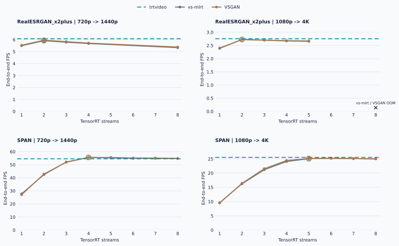
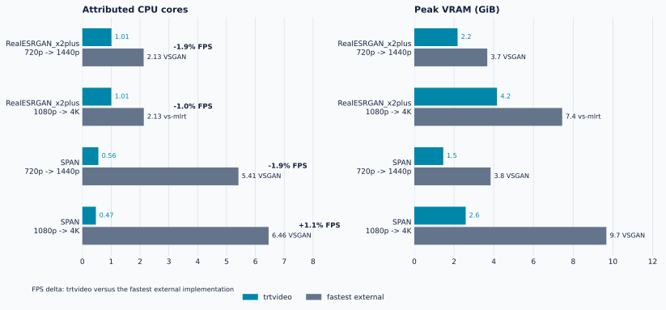

# RTX 3090 Comparative Benchmark

This directory contains the current privacy-reviewed RTX 3090 benchmark
evidence. All result classes were measured on 2026-07-30 from clean revision
`8adbca96b829bd2f791fe5bce5c27029e283b79d`.

The complete matrix used the same physical RTX 3090, Ryzen 5 5600, driver
595.84, models, source clips, output contract, and active 350 W board limit. No
reduced power cap was applied. RealESRGAN used 30 warmup frames and SPAN used
100; every measured run processed 1000 frames. Final comparisons use three
rotated rounds with ten seconds idle between processes.

Both execution profiles passed model-space and 1000-frame product-output quality
gates at 720p and 1080p. Both tuned cross-resolution publication matrices report
`valid` and `publishable`.

## Best-Tuned Results

Tuned candidates were selected by a separate sweep. Selected profiles then
passed fresh quality gates and independent rotated campaigns; sweep FPS is not
used as the final comparison value.

| Workload | Input | trtvideo | vs-mlrt | VSGAN | Project vs fastest external |
|---|---|---:|---:|---:|---:|
| RealESRGAN_x2plus | 720p | 6.204 FPS | 6.273 FPS | **6.308 FPS** | -1.66% |
| RealESRGAN_x2plus | 1080p | 2.813 FPS | **2.838 FPS** | 2.835 FPS | -0.91% |
| SPAN | 720p | 56.187 FPS | 56.487 FPS | **56.571 FPS** | -0.68% |
| SPAN | 1080p | **26.229 FPS** | 25.757 FPS | 25.766 FPS | +1.80% |

All four rows are within the predeclared +/-5% parity band. The earlier SPAN
720p deficit is not present in this post-change measurement. The measured
revision includes the torch-free runtime and streaming mux, while the corrected
tuning contract gives both external implementations the same
runtime-default-thread grid.

### Tuned Stream Sweep

<picture>
  <source media="(prefers-color-scheme: dark)" srcset="figures/tuned-sweep-dark.svg">
  
</picture>

Rings mark the selected external profiles. The dashed `trtvideo` reference is
the independent final-campaign median, not a sweep result. RealESRGAN vs-mlrt
was measured at streams 2-4; no unmeasured 5/6 points are interpolated. SPAN and
VSGAN retain the full declared 2-6 grid.

### Selected Profiles

| Workload | Input | vs-mlrt winner | VSGAN winner |
|---|---|---|---|
| RealESRGAN_x2plus | 720p | streams 2 | streams 2 |
| RealESRGAN_x2plus | 1080p | streams 2 | streams 2 |
| SPAN | 720p | streams 4 | streams 5 |
| SPAN | 1080p | streams 6 | streams 6 |

Every selected profile uses automatic vspipe requests, runtime-default
VapourSynth threads, and CUDA Graph disabled. The complete candidate curves,
including retained VSGAN four-thread and CUDA Graph reference points, are in
[`tuned.json`](tuned.json).

### Resource Medians

CPU is attributed to the measured child-process tree through
`getrusage(RUSAGE_CHILDREN)`, not to total host activity.

| Workload | Input | Implementation | FPS | CPU cores | GPU util | Power | J/frame | Peak VRAM | Bitrate |
|---|---|---|---:|---:|---:|---:|---:|---:|---:|
| RealESRGAN | 720p | trtvideo | 6.204 | **1.011** | 98.70% | 338.43 W | 54.55 | **2226.9 MiB** | 32.714 Mbps |
| RealESRGAN | 720p | vs-mlrt | 6.273 | 2.126 | 98.12% | 336.94 W | 53.71 | 3764.4 MiB | 35.042 Mbps |
| RealESRGAN | 720p | VSGAN | **6.308** | 2.129 | 98.22% | 338.18 W | **53.61** | 3762.4 MiB | 35.042 Mbps |
| RealESRGAN | 1080p | trtvideo | 2.813 | **1.007** | 99.43% | 340.13 W | 120.93 | **4264.1 MiB** | 56.651 Mbps |
| RealESRGAN | 1080p | vs-mlrt | **2.838** | 2.135 | 99.14% | 339.96 W | **119.84** | 7625.1 MiB | 60.200 Mbps |
| RealESRGAN | 1080p | VSGAN | 2.835 | 2.130 | 99.12% | 340.22 W | 119.97 | 7623.1 MiB | 60.200 Mbps |
| SPAN | 720p | trtvideo | 56.187 | **0.564** | 92.30% | 315.25 W | 5.63 | **1493.7 MiB** | 32.806 Mbps |
| SPAN | 720p | vs-mlrt | 56.487 | 5.450 | 92.55% | 311.71 W | 5.53 | 3936.4 MiB | 35.533 Mbps |
| SPAN | 720p | VSGAN | **56.571** | 6.466 | 92.43% | 310.73 W | **5.49** | 4760.4 MiB | 35.533 Mbps |
| SPAN | 1080p | trtvideo | **26.229** | **0.478** | 96.46% | 326.56 W | 12.43 | **2693.7 MiB** | 56.221 Mbps |
| SPAN | 1080p | vs-mlrt | 25.757 | 7.623 | 94.30% | 319.48 W | **12.40** | 11755.1 MiB | 60.466 Mbps |
| SPAN | 1080p | VSGAN | 25.766 | 7.550 | 93.78% | 320.55 W | 12.44 | 11753.1 MiB | 60.466 Mbps |

`trtvideo` reaches parity while using roughly half the CPU and substantially
less VRAM on RealESRGAN. On SPAN it uses about 0.5 CPU cores instead of
5.5-7.6 and 1.5-2.7 GiB VRAM instead of 3.9-11.8 GiB.

### Same Throughput, Lower Resource Use

<picture>
  <source media="(prefers-color-scheme: dark)" srcset="figures/throughput-resources-dark.svg">
  
</picture>

Both panels use linear scales. Each row compares `trtvideo` with the fastest
external implementation for that workload; the annotation reports the
end-to-end FPS difference for the same pair.

## Upstream-Default Results

`vs-mlrt` uses automatic vspipe requests, one TensorRT stream,
runtime-default VapourSynth threads, and no CUDA Graph. VSGAN uses automatic
requests, four TensorRT streams, four VapourSynth threads, and no CUDA Graph.
`trtvideo` uses its production GPU-resident path unchanged.

| Workload | Input | trtvideo | vs-mlrt | VSGAN | Project vs fastest external |
|---|---|---:|---:|---:|---:|
| RealESRGAN_x2plus | 720p | **6.204 FPS** | 5.721 FPS | 6.201 FPS | +0.06% |
| RealESRGAN_x2plus | 1080p | **2.815 FPS** | 2.455 FPS | 2.811 FPS | +0.14% |
| SPAN | 720p | **56.160 FPS** | 26.835 FPS | 50.890 FPS | +10.36% |
| SPAN | 1080p | **26.273 FPS** | 9.514 FPS | 21.734 FPS | +20.88% |

The RealESRGAN rows are parity. The lightweight SPAN workload exposes the
scheduling and frame-transport cost of the upstream defaults: the project is
10.36% faster at 720p and 20.88% faster at 1080p.

The project configuration is identical between upstream-default and tuned
campaigns. Its medians differ by at most 0.17% across the two independently
measured classes, providing a control signal for harness reproducibility.

## Quality Gates

All winner profiles passed model-space validation on frames 0, 499, and 999.
Product-output metrics compare all 1000 decoded frames against `trtvideo`.

| Workload | Input | Candidate | PSNR | SSIM | Status |
|---|---|---|---:|---:|---|
| RealESRGAN_x2plus | 720p | vs-mlrt / VSGAN | 49.125 dB | 0.994492 | valid |
| RealESRGAN_x2plus | 1080p | vs-mlrt / VSGAN | 50.362 dB | 0.995249 | valid |
| SPAN | 720p | vs-mlrt / VSGAN | 48.898 dB | 0.995706 | valid |
| SPAN | 1080p | vs-mlrt / VSGAN | 50.291 dB | 0.996216 | valid |

VSGAN uses the same ONNX and weights but a separately built TensorRT 10.16
engine because its runtime cannot load the project's TensorRT 11 engine.

The identical vs-mlrt and VSGAN rows are expected, not reused measurements.
Both wrappers execute the `libvstrt.so` plugin through the same VapourSynth
graph and encoder contract. The quality jobs used separate output directories
and produced different capture manifests, run manifests, container image IDs,
and engine SHA-256 values. Despite that independent provenance, all six
model-space tensor SHA-256 values and the final MP4 SHA-256 match for each
workload. The retained PSNR/SSIM logs and visual crops are also byte-identical.

| Workload | Input | Candidate tensor-set SHA-256 | Candidate MP4 SHA-256 |
|---|---|---|---|
| RealESRGAN_x2plus | 720p | `fc16fa15a622e63d...` | `123bfd2d4c333b5e...` |
| RealESRGAN_x2plus | 1080p | `cc67551013893833...` | `59e6780ad2be4d55...` |
| SPAN | 720p | `8e7a291bdc7e3b68...` | `a0bb9fdc12530d90...` |
| SPAN | 1080p | `751b765d34995af5...` | `50244984f6b8110a...` |

The full fingerprints and provenance assertions are retained in both result
JSON files. The tensor-set fingerprint is the SHA-256 of the ordered
`stage<TAB>frame_index<TAB>artifact_sha256<LF>` records from the capture
manifest.

The repeated model-space minimum across RealESRGAN and SPAN at the same input
resolution is also expected. In each case the minimum occurs at input frame
499, before model inference. Both workloads use the same source clip and
preprocessing, so that input tensor and its comparison metric are identical.

## Diagnostics

### TensorRT Ceiling

`trtexec` is an inference-only diagnostic, not a product competitor.

| Workload | Input | trtexec median | trtvideo tuned | Pipeline efficiency |
|---|---|---:|---:|---:|
| RealESRGAN_x2plus | 720p | 6.283 QPS | 6.204 FPS | 98.73% |
| RealESRGAN_x2plus | 1080p | 2.829 QPS | 2.813 FPS | 99.42% |
| SPAN | 720p | 60.951 QPS | 56.187 FPS | 92.18% |
| SPAN | 1080p | 27.553 QPS | 26.229 FPS | 95.20% |

CUDA Graph and data transfers were disabled for the TensorRT ceiling.

### Nsight Systems

A 120-frame SPAN 1080p trace confirms the GPU-resident architecture:

- CUDA kernel intervals cover 99.37% of the frame-loop interval;
- NVDEC and NVENC workloads overlap CUDA kernels by 93.55% and 99.54%;
- no H2D or D2H copy occurs during the measured frame loop;
- D2D copies average 14.83 MiB and 0.043 ms per frame.

Profiler overhead makes trace FPS non-publishable. The trace supports the
architecture claim rather than adding another throughput result.

## Encoding Note

All products use the same H.264 P4/HQ single-pass CBR contract, GOP 24, zero
B-frames, and disabled lookahead/AQ. The FFmpeg NVENC path inserts filler NAL
units for stricter CBR while PyNvVideoCodec does not, producing the visible
bitrate difference. Full decode, timestamps, color metadata, and quality gates
remain valid.

## Published Data

[`index.json`](index.json) records result composition, revision, and SHA-256.
[`upstream-default.json`](upstream-default.json), [`tuned.json`](tuned.json),
and [`diagnostics.json`](diagnostics.json) retain per-run FPS, resources,
profiles, quality summaries, assets, and raw-evidence hashes.

All SVG figures are generated from those committed JSON files with
`make -C benchmarks figures`; `make -C benchmarks figures-check` verifies
byte-for-byte reproducibility.

MP4 outputs, FP32 tensor captures, NVML time series, engines, models, event
logs, and profiler traces remain outside Git. A second live-action confirmation
clip remains future work.
