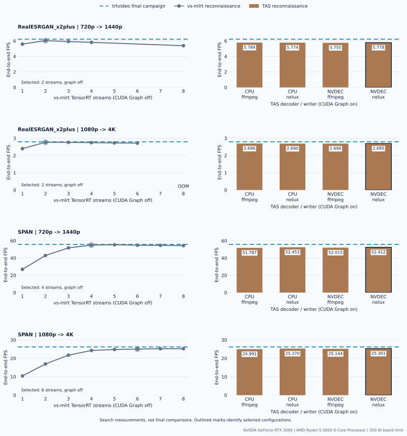
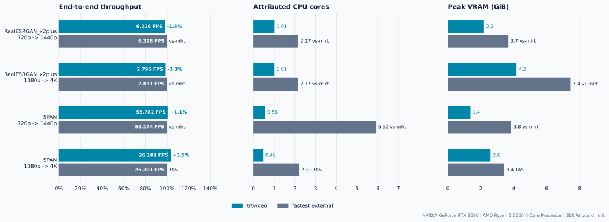

# RTX 3090 Comparative Benchmark

September 2026 evidence for **trtvideo / vs-mlrt / TheAnimeScripter (TAS)**,
collected on one RTX 3090 and Ryzen 5 5600 (6 cores / 12 threads) server at the
stock **350 W** board limit. All participants use TensorRT **11.2.1.2** and
driver **595.84**, from clean repository revision
`b5bf437e17813ea2f6fc1b268a479b612f83dc08`. Tuned measurements are dated
September 7 UTC; diagnostics are dated September 8 UTC.

The shared workload is the pinned CC0 Madrid live-action clip. Each final
campaign measures 1000 frames in three rotated rounds, with ten seconds idle
between processes, 30 warmup frames for RealESRGAN, and 100 for SPAN. FPS is
frames divided by measured process lifetime, including startup and finalization.
Search and quality checks are separate from these final measurements.

## Best-Tuned Results

| Workload | Input | trtvideo | vs-mlrt | TAS | trtvideo vs fastest external |
|---|---|---:|---:|---:|---:|
| RealESRGAN_x2plus | 720p | 6.216 FPS | **6.328 FPS** | 5.980 FPS | -1.77% |
| RealESRGAN_x2plus | 1080p | 2.795 FPS | **2.831 FPS** | 2.762 FPS | -1.27% |
| SPAN | 720p | **55.782 FPS** | 55.174 FPS | 52.570 FPS | +1.10% |
| SPAN | 1080p | **26.181 FPS** | 25.217 FPS | 25.301 FPS | +3.48% |

All four rows fall within the predeclared +/-5% throughput-parity band.
trtvideo uses less attributed CPU and peak VRAM than either external product
in every row. TAS substantially reduces the external resource footprint
relative to the VapourSynth path; the complete table below includes both.

### Session Validity And Retries

Both cross-resolution matrices and all retained quality reports are `valid`
and `publishable`. All **36 final campaign runs** passed, with no forbidden
throttle reasons and a maximum campaign temperature of **66 C**. The largest
full FPS spread is **0.785%**; no final campaign needed extra rounds.
`sw_power_cap` is permitted under the declared 350 W policy.

This was not a failure-free session. The source bundle retains **12 archived
failed attempts** from preflight, search, winner quality, and diagnostics:
eleven with `sw_thermal_slowdown`, and one with
`hw_slowdown` / `hw_thermal_slowdown`. They were rejected and retried, not
included in the published medians. This validates the retained runs under the
contract; it does not establish sustained thermal stability or rule out
selection effects from retries.

The retained invalid search point is vs-mlrt at eight streams on RealESRGAN
1080p: a hashed CUDA out-of-memory resource ceiling, not a zero-FPS result.

### Tuned Stream Sweep

<picture>
  <source media="(prefers-color-scheme: dark)" srcset="figures/tuned-sweep-dark.svg">
  
</picture>

Lines and bars show one-run, 300-frame reconnaissance. Rings and outlined bars
identify profiles selected after independent 1000-frame confirmation; the
dashed trtvideo line is the final-campaign median, not a search measurement.
The vs-mlrt curve uses graph-off profiles; selected profiles are named explicitly.

| Workload | Input | vs-mlrt winner | vs-mlrt search completion | TAS winner |
|---|---|---|---|---|
| RealESRGAN_x2plus | 720p | streams 2, graph off | decline confirmed | NVDEC / neLux |
| RealESRGAN_x2plus | 1080p | streams 2, graph off | resource ceiling | NVDEC / neLux |
| SPAN | 720p | streams 4, graph off | range exhausted | NVDEC / neLux |
| SPAN | 1080p | streams 6, graph off | range exhausted | NVDEC / neLux |

vs-mlrt uses automatic vspipe requests and VapourSynth threads. Its tie-break
prefers the lowest confirmed stream count within 1% of peak, then graph off.
TAS preflight validates all four CPU/NVDEC x FFmpeg/neLux combinations before
search; the grid is exhausted on every workload. All TAS winners use CUDA
Graph. See the [methodology](../../methodology.md) for shortlisting and tie-breaks.

### Intra-Session Reproducibility

The selected external profiles were measured during confirmation and again in
the final rotated campaigns. The largest absolute median difference is **0.338%**.
This is a same-session harness control, not an additional product comparison.

| Workload | Input | vs-mlrt final vs confirmation | TAS final vs confirmation |
|---|---|---:|---:|
| RealESRGAN_x2plus | 720p | +0.039% | -0.132% |
| RealESRGAN_x2plus | 1080p | -0.067% | +0.147% |
| SPAN | 720p | +0.172% | +0.047% |
| SPAN | 1080p | +0.011% | +0.338% |

### Resource Medians

CPU cores are attributed to the measured child-process tree through
`getrusage(RUSAGE_CHILDREN)`, not total host activity. Resource columns are
medians of per-run metrics; peak VRAM is the median of per-run device peaks.

| Workload | Input | Implementation | FPS | CPU cores | GPU util | Power | J/frame | Peak VRAM | Bitrate |
|---|---|---|---:|---:|---:|---:|---:|---:|---:|
| RealESRGAN | 720p | trtvideo | 6.216 | 1.010 | 98.61% | 339.64 W | 54.65 | 2241.9 MiB | 34.484 Mbps |
| RealESRGAN | 720p | vs-mlrt | 6.328 | 2.165 | 97.83% | 337.60 W | 53.35 | 3764.6 MiB | 34.961 Mbps |
| RealESRGAN | 720p | TAS | 5.980 | 1.997 | 98.94% | 338.58 W | 56.64 | 2820.9 MiB | 34.955 Mbps |
| RealESRGAN | 1080p | trtvideo | 2.795 | 1.006 | 99.47% | 341.09 W | 121.97 | 4268.3 MiB | 58.971 Mbps |
| RealESRGAN | 1080p | vs-mlrt | 2.831 | 2.165 | 99.05% | 340.20 W | 120.16 | 7625.3 MiB | 59.870 Mbps |
| RealESRGAN | 1080p | TAS | 2.762 | 2.000 | 99.39% | 340.58 W | 123.30 | 5211.6 MiB | 59.859 Mbps |
| SPAN | 720p | trtvideo | 55.782 | 0.560 | 91.99% | 315.17 W | 5.66 | 1399.6 MiB | 34.488 Mbps |
| SPAN | 720p | vs-mlrt | 55.174 | 5.915 | 89.87% | 308.22 W | 5.58 | 3936.6 MiB | 34.897 Mbps |
| SPAN | 720p | TAS | 52.570 | 2.130 | 89.61% | 308.22 W | 5.86 | 2032.9 MiB | 34.852 Mbps |
| SPAN | 1080p | trtvideo | 26.181 | 0.475 | 96.59% | 326.36 W | 12.47 | 2652.3 MiB | 58.850 Mbps |
| SPAN | 1080p | vs-mlrt | 25.217 | 8.247 | 92.39% | 316.69 W | 12.57 | 11755.3 MiB | 59.712 Mbps |
| SPAN | 1080p | TAS | 25.301 | 2.202 | 95.56% | 321.36 W | 12.70 | 3501.6 MiB | 59.757 Mbps |

### Same Throughput, Lower Resource Use

<picture>
  <source media="(prefers-color-scheme: dark)" srcset="figures/throughput-resources-dark.svg">
  
</picture>

Each row compares against its fastest external product, not necessarily the
least resource-intensive one. FPS is normalized to that external result;
CPU and VRAM retain linear absolute scales.

## Quality Gates

All model-export, shared-input inference, and final-product gates passed.
Preprocessing is recorded separately as a diagnostic, not confused with
same-input inference parity. TAS uses its native pipeline at pinned source
revision `ac259ddf13c191230a4c65a4b251c9fb28884104`; engine and runtime identity
are retained in [`tuned.json`](tuned.json).

On the shared-input samples, vs-mlrt matched trtvideo exactly. TAS also matched
except SPAN 720p, whose maximum p99 absolute error was **0.000732422** and
maximum RMSE **0.000187242**, within the declared inference thresholds.

Final encoded output is compared against trtvideo, not against ground truth.
The acceptance thresholds are PSNR >=35 dB and SSIM >=0.95:

| Workload | Input | Candidate | PSNR | SSIM |
|---|---|---|---:|---:|
| RealESRGAN_x2plus | 720p | vs-mlrt | 44.719 dB | 0.991528 |
| RealESRGAN_x2plus | 720p | TAS | 44.466 dB | 0.991633 |
| RealESRGAN_x2plus | 1080p | vs-mlrt | 45.173 dB | 0.992480 |
| RealESRGAN_x2plus | 1080p | TAS | 44.764 dB | 0.992413 |
| SPAN | 720p | vs-mlrt | 45.230 dB | 0.991902 |
| SPAN | 720p | TAS | 45.561 dB | 0.992723 |
| SPAN | 1080p | vs-mlrt | 45.791 dB | 0.993051 |
| SPAN | 1080p | TAS | 45.845 dB | 0.993476 |

## Diagnostics

### TensorRT Ceiling

`trtexec` is an inference-only diagnostic, not a product competitor. CUDA
Graph and data transfers are disabled for this diagnostic class.

| Workload | Input | trtexec median |
|---|---|---:|
| RealESRGAN_x2plus | 720p | 6.304 QPS |
| RealESRGAN_x2plus | 1080p | 2.805 QPS |
| SPAN | 720p | 61.155 QPS |
| SPAN | 1080p | 27.665 QPS |

Diagnostics rebuilt equivalent-contract engines on the same server, revision,
driver, and power policy. Their serialized hashes differ from the tuned
engines, so these numbers are not an exact decomposition of pipeline FPS.

### Nsight Systems

The validated 120-frame SPAN 1080p trace has **97.84%** CUDA kernel-time coverage
of the frame loop, **94.36% / 96.62%** NVDEC/NVENC overlap with CUDA kernels,
and **zero H2D / D2H copies** inside the frame loop. Its 480 D2D copies average
14.83 MiB and 0.043 ms per frame; one 0.797 MiB H2D initialization copy precedes
the loop. These findings are recomputed from retained SQLite data. Trace FPS
is not a publishable performance measurement because of profiler overhead.

## Encoding Note

All products use the declared H.264 P4/HQ single-pass CBR contract, GOP 24,
zero output B-frames, and disabled lookahead/AQ. Native codec and mux paths
differ; measured bitrate is reported rather than assumed identical. Full
decode, timestamps, frame count, color metadata, and bitrate validation passed.

## Published Data

[`index.json`](index.json) records composition, revision, and hashes;
[`tuned.json`](tuned.json) and [`diagnostics.json`](diagnostics.json) contain
the self-contained result classes. Both workflow states completed (45/45 tuned
steps and 18/18 diagnostic steps). Source bundle:
`artefacts/benchmarks/08092026-3090-tuned_diagnostics`.

Publication checked report hashes, reaggregated campaigns and matrices, and
recomputed NVML/SQLite summaries. The copied bundle contains reports, logs,
and quality crops, but not the full MP4 or FP32 tensor captures; pixel metrics
were not independently rerun during publication. Their recorded gate results
and hashes remain inspectable. Large runtime artifacts are not added to Git.

Regenerate both light/dark figure pairs with `make -C benchmarks figures`;
`make -C benchmarks figures-check` checks byte-for-byte reproducibility.
