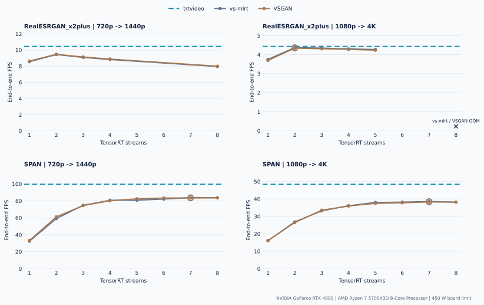

# RTX 4090 Comparative Benchmark

This directory contains the privacy-reviewed RTX 4090 tuned and diagnostic
evidence measured on 2026-08-18 from clean revision
`fdd59ddc7994e3e139d4b65f801b555eab62cfdb`, on one RTX 4090 and Ryzen 7
5700X3D server with driver 595.84 and the stock 450 W board limit.

Every workload uses the same pinned CC0 Madrid live-action clip, model, output
contract, and benchmark environment across implementations. Final campaigns
measure 1000 frames in three rotated rounds with ten seconds idle between
processes; RealESRGAN uses 30 warmup frames and SPAN uses 100. Both
cross-resolution matrices and every retained quality report are `valid` and
`publishable`. All 36 retained campaign runs are valid, no thermal throttle
reason was recorded, campaign temperatures peaked at 58-65 C, and diagnostics
peaked at 68 C. `sw_power_cap` is an allowed property of the declared 450 W
policy.

The only invalid search artifacts are the two expected RealESRGAN 1080p
eight-stream CUDA out-of-memory ceilings. They are reproducibly classified and
hashed by the adaptive search contract rather than treated as FPS points.

## Best-Tuned Results

The adaptive search and full confirmation select external profiles first.
Selected profiles then pass fresh quality gates and independent rotated
campaigns, so reconnaissance FPS is never used as a final comparison value.

| Workload | Input | trtvideo | vs-mlrt | VSGAN | trtvideo vs fastest external |
|---|---|---:|---:|---:|---:|
| RealESRGAN_x2plus | 720p | **10.462 FPS** | 10.235 FPS | 10.285 FPS | +1.72% |
| RealESRGAN_x2plus | 1080p | 4.436 FPS | **4.501 FPS** | 4.468 FPS | -1.43% |
| SPAN | 720p | **99.655 FPS** | 84.099 FPS | 84.536 FPS | +17.89% |
| SPAN | 1080p | **48.467 FPS** | 38.621 FPS | 38.535 FPS | +25.49% |

Both RealESRGAN rows fall inside the predeclared +/-5% throughput-parity band.
Both SPAN rows exceed the same threshold and are confirmed `trtvideo` speed
advantages. These values form an independent RTX 4090 session and are not
aggregated row-by-row with the RTX 3090 result, which uses a different CPU and
power policy.

### Tuned Stream Sweep

<picture>
  <source media="(prefers-color-scheme: dark)" srcset="figures/tuned-sweep-dark.svg">
  
</picture>

The lines show one-run, 300-frame reconnaissance measurements. Rings mark the
profiles selected after full 1000-frame confirmation; the dashed `trtvideo`
reference is the independent final-campaign median. Search starts at one stream
and either confirms two declines greater than 1%, reaches the declared
eight-stream boundary, or records a reproducible resource ceiling.

| Workload | Input | vs-mlrt winner | VSGAN winner | Search completion |
|---|---|---|---|---|
| RealESRGAN_x2plus | 720p | streams 2, graph on | streams 2, graph on | decline confirmed |
| RealESRGAN_x2plus | 1080p | streams 2, graph off | streams 2, graph off | resource ceiling |
| SPAN | 720p | streams 7, graph off | streams 7, graph off | range exhausted |
| SPAN | 1080p | streams 7, graph off | streams 7, graph off | range exhausted |

Every selected profile uses automatic vspipe requests and runtime-default
VapourSynth threads. Stage 2 confirms the three strongest reconnaissance
points; within that fully measured shortlist, the tie-break chooses the lowest
stream count within 1% of confirmed peak throughput and then prefers CUDA Graph
off. CUDA Graph remains selected for both RealESRGAN 720p winners because its
confirmed gain exceeds that equivalence band.

### Intra-Session Reproducibility

Selected external profiles were measured independently during confirmation and
again in the final rotated campaign. The largest absolute median difference is
0.469%:

| Workload | Input | vs-mlrt final vs confirmation | VSGAN final vs confirmation |
|---|---|---:|---:|
| RealESRGAN_x2plus | 720p | -0.090% | -0.178% |
| RealESRGAN_x2plus | 1080p | +0.025% | +0.010% |
| SPAN | 720p | +0.245% | +0.469% |
| SPAN | 1080p | +0.233% | -0.152% |

This is a same-session harness control, not another product comparison.
`trtvideo` is not a tuning candidate and therefore has no confirmation run.

### Resource Medians

CPU is attributed to the measured child-process tree through
`getrusage(RUSAGE_CHILDREN)`, not to total host activity.

| Workload | Input | Implementation | FPS | CPU cores | GPU util | Power | J/frame | Peak VRAM | Bitrate |
|---|---|---|---:|---:|---:|---:|---:|---:|---:|
| RealESRGAN | 720p | trtvideo | **10.462** | **1.021** | 97.79% | 417.86 W | **39.97** | **2491.1 MiB** | 34.543 Mbps |
| RealESRGAN | 720p | vs-mlrt | 10.235 | 2.279 | 96.40% | 413.56 W | 40.41 | 4062.8 MiB | 34.972 Mbps |
| RealESRGAN | 720p | VSGAN | 10.285 | 2.278 | 96.65% | 413.87 W | 40.22 | 4058.8 MiB | 34.972 Mbps |
| RealESRGAN | 1080p | trtvideo | 4.436 | **1.011** | 99.17% | 421.81 W | 95.08 | **4420.5 MiB** | 58.974 Mbps |
| RealESRGAN | 1080p | vs-mlrt | **4.501** | 2.272 | 98.53% | 421.22 W | **93.58** | 7907.5 MiB | 59.865 Mbps |
| RealESRGAN | 1080p | VSGAN | 4.468 | 2.274 | 98.76% | 420.35 W | 94.07 | 7903.5 MiB | 59.878 Mbps |
| SPAN | 720p | trtvideo | **99.655** | **0.742** | 87.23% | 379.87 W | **3.81** | **1551.8 MiB** | 34.483 Mbps |
| SPAN | 720p | vs-mlrt | 84.099 | 11.735 | 74.74% | 335.06 W | 3.98 | 6692.8 MiB | 34.899 Mbps |
| SPAN | 720p | VSGAN | 84.536 | 11.833 | 75.62% | 335.68 W | 3.97 | 6688.8 MiB | 34.899 Mbps |
| SPAN | 1080p | trtvideo | **48.467** | **0.574** | 93.90% | 413.37 W | **8.53** | **2804.5 MiB** | 58.866 Mbps |
| SPAN | 1080p | vs-mlrt | 38.621 | 12.168 | 80.95% | 347.81 W | 9.01 | 13853.5 MiB | 59.712 Mbps |
| SPAN | 1080p | VSGAN | 38.535 | 12.114 | 80.38% | 348.28 W | 9.05 | 13849.5 MiB | 59.712 Mbps |

For the fastest external result in each row, external CPU use is 2.23-21.19x
`trtvideo` and peak VRAM is 1.63-4.94x `trtvideo`.

### Throughput And Resource Use

<picture>
  <source media="(prefers-color-scheme: dark)" srcset="figures/throughput-resources-dark.svg">
  
</picture>

Each row compares `trtvideo` with the fastest external implementation on linear
resource scales. The CPU panel annotates the end-to-end FPS difference for the
same pair; it does not imply throughput parity where the difference exceeds 5%.

## Quality Gates

Shared-input inference checks frames 0, 499, and 999. All output tensors are
exact except the separately built TensorRT 10.16 VSGAN engine on RealESRGAN
1080p; its worst output has p99 absolute error 0.000977, RMSE 0.000276, and
71.17 dB PSNR, well inside the declared numerical thresholds. Production
preprocessing differences are recorded separately as a diagnostic rather than
conflated with inference correctness.

Product-output metrics compare all 1000 decoded frames against `trtvideo`:

| Workload | Input | Candidate | PSNR | SSIM | Status |
|---|---|---|---:|---:|---|
| RealESRGAN_x2plus | 720p | vs-mlrt / VSGAN | 44.718 dB | 0.991526 | valid |
| RealESRGAN_x2plus | 1080p | vs-mlrt | 45.172 dB | 0.992478 | valid |
| RealESRGAN_x2plus | 1080p | VSGAN | 45.172 dB | 0.992476 | valid |
| SPAN | 720p | vs-mlrt / VSGAN | 45.228 dB | 0.991895 | valid |
| SPAN | 1080p | vs-mlrt / VSGAN | 45.791 dB | 0.993051 | valid |

vs-mlrt and VSGAN were captured independently with different run manifests,
capture manifests, container image IDs, and engine SHA-256 values. Their tensor
sets and MP4 outputs are byte-identical in three workloads. RealESRGAN 1080p is
not byte-identical across the TensorRT 11 and 10.16 engines, but both numerical
quality gates pass. Per-workload fingerprints and provenance checks are retained
in [`tuned.json`](tuned.json).

## Diagnostics

### TensorRT Ceiling

`trtexec` is an inference-only diagnostic, not a product competitor.

| Workload | Input | trtexec median |
|---|---|---:|
| RealESRGAN_x2plus | 720p | 10.720 QPS |
| RealESRGAN_x2plus | 1080p | 4.477 QPS |
| SPAN | 720p | 116.443 QPS |
| SPAN | 1080p | 53.481 QPS |

CUDA Graph and data transfers are disabled for the TensorRT ceiling. The tuned
and diagnostic result sets share one clean revision, server, driver, ONNX/build
contract, and 450 W policy. The diagnostics workflow deliberately rebuilt each
TensorRT engine, so serialized engine hashes differ from the tuned campaign.
For that reason the report does not derive a precise pipeline-efficiency ratio
between the two result classes.

### Nsight Systems

A validated 120-frame SPAN 1080p trace confirms the GPU-resident frame loop:

- merged CUDA kernel intervals cover 89.09% of the frame-loop interval;
- NVDEC and NVENC workloads overlap CUDA kernels by 90.01% and 92.23%;
- zero H2D and zero D2H copies occur during the frame loop;
- 480 D2D copies average 14.83 MiB and 0.020 ms per frame;
- the only H2D copy is a 0.797 MiB initialization transfer before the frame loop.

These findings are recomputed from the retained SQLite export by the diagnostic
publication tool. Profiler overhead makes trace FPS non-publishable; the trace
supports the architecture claim rather than adding a throughput result.

## Encoding Note

All products use the same H.264 P4/HQ single-pass CBR contract, GOP 24, zero
output B-frames, and disabled lookahead/AQ. The FFmpeg NVENC path inserts filler
NAL units for stricter CBR while PyNvVideoCodec does not, producing the small
bitrate difference. Full decode, timestamps, color metadata, and quality gates
remain valid.

## Published Data

[`index.json`](index.json) records result composition, revision, and SHA-256.
[`tuned.json`](tuned.json) and [`diagnostics.json`](diagnostics.json) are the two
self-contained result classes in this Madrid snapshot. The executable
upstream-default profile remains part of the benchmark methodology, but no
legacy media result is mixed into this publication.

All SVG figures are generated from committed `tuned.json` with
`make -C benchmarks figures`; `make -C benchmarks figures-check` verifies every
published hardware directory byte-for-byte. MP4 outputs, FP32 tensor captures,
NVML time series, engines, models, event logs, and profiler traces remain
outside Git; the compact JSON retains hashes back to that raw evidence.
