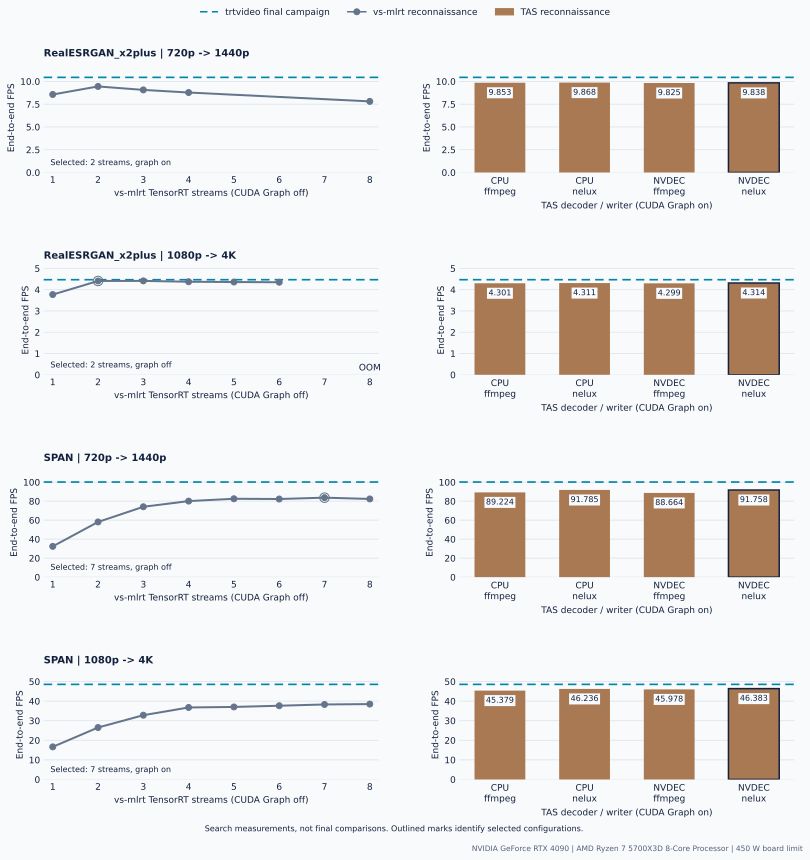
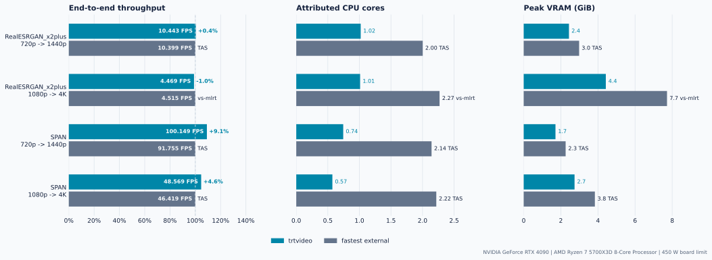

# RTX 4090 Comparative Benchmark

September 7, 2026 UTC evidence for **trtvideo / vs-mlrt / TheAnimeScripter (TAS)**,
collected on one RTX 4090 and Ryzen 7 5700X3D (8 cores / 16 threads) server at
the stock **450 W** board limit. All participants use TensorRT **11.2.1.2** and
driver **595.84**, from clean repository revision
`b5bf437e17813ea2f6fc1b268a479b612f83dc08`.

The shared workload is the pinned CC0 Madrid live-action clip. Final campaigns
measure 1000 frames in rotated rounds, with ten seconds idle between processes,
30 warmup frames for RealESRGAN, and 100 for SPAN. FPS is frames divided by
measured process lifetime, including startup and finalization. Search and
quality checks are separate from these final measurements.

## Best-Tuned Results

| Workload | Input | trtvideo | vs-mlrt | TAS | trtvideo vs fastest external |
|---|---|---:|---:|---:|---:|
| RealESRGAN_x2plus | 720p | **10.443 FPS** | 10.279 FPS | 10.399 FPS | +0.42% |
| RealESRGAN_x2plus | 1080p | 4.469 FPS | **4.515 FPS** | 4.442 FPS | -1.02% |
| SPAN | 720p | **100.149 FPS** | 84.051 FPS | 91.755 FPS | +9.15% |
| SPAN | 1080p | **48.569 FPS** | 38.863 FPS | 46.419 FPS | +4.63% |

Under the predeclared +/-5% parity band, **SPAN 720p is a confirmed speed
advantage**. Both RealESRGAN rows and SPAN 1080p are parity results.
trtvideo uses less attributed CPU and peak VRAM than either external product
in every row. Independent hardware sessions are not aggregated across hosts.

### Session Validity And Retries

Both cross-resolution matrices and all retained quality reports are `valid`
and `publishable`. All **42 final campaign runs** passed, with no forbidden
throttle reasons and a maximum campaign temperature of **69 C**.
`sw_power_cap` is permitted under the declared 450 W policy.

RealESRGAN 1080p required **five rounds per implementation**, not three.
vs-mlrt round 3 measured **4.284 FPS**: full spread **5.49%**, with a
four-of-five consensus spread of **1.49%**. This satisfies the predeclared
stability policy with an explicit outlier warning. The published median retains
all five runs; the outlier was not silently removed. Other workloads use three
rounds.

The source bundle also retains **three archived failed attempts**: two
vs-mlrt CUDA launch failures on RealESRGAN 1080p, and a TAS NVDEC/neLux
confirmation hang on that workload. These attempts were rejected and retried,
not included in final medians. Successful retries do not prove that the
underlying faults were resolved. The retained invalid search point is
vs-mlrt at eight streams on RealESRGAN 1080p, recorded as a hashed CUDA OOM
resource ceiling rather than an FPS measurement.

### Cross-GPU Scaling Observation

The earlier hypothesis concerned the CPU/host-memory VapourSynth path: more
host cores might reduce its SPAN gap. The new measurements still show a larger
gap against vs-mlrt on the faster GPU, but TAS materially changes the comparison:

| SPAN input | RTX 3090 vs vs-mlrt | RTX 4090 vs vs-mlrt | RTX 3090 vs TAS | RTX 4090 vs TAS |
|---|---:|---:|---:|---:|
| 720p | +1.10% | +19.15% | +6.11% | +9.15% |
| 1080p | +3.82% | +24.98% | +3.48% | +4.63% |

TAS's winning native NVDEC/neLux path uses about **2.14 / 2.22 CPU cores**
at 720p/1080p, compared with vs-mlrt's **11.63 / 11.78**. It reaches
**91.76 / 46.42 FPS**, substantially narrowing the gap despite using less CPU.

The data remain consistent with host processing and frame transport limiting
the measured VapourSynth path as GPU inference gets faster. They do not
establish a universal fixed-overhead penalty for every external implementation,
nor predict that trtvideo's advantage must grow on all newer hardware.
CPU, GPU, and power policy differ between the two hosts; this is not a
controlled CPU-only A/B or an external-path profiler trace.

### Tuned Stream Sweep

<picture>
  <source media="(prefers-color-scheme: dark)" srcset="figures/tuned-sweep-dark.svg">
  
</picture>

Lines and bars show one-run, 300-frame reconnaissance. Rings and outlined bars
identify profiles selected after independent 1000-frame confirmation; the
dashed trtvideo line is the final-campaign median, not a search measurement.
The vs-mlrt curve uses graph-off profiles; selected graph-on profiles are
named explicitly rather than plotted as if measured during reconnaissance.

| Workload | Input | vs-mlrt winner | vs-mlrt search completion | TAS winner |
|---|---|---|---|---|
| RealESRGAN_x2plus | 720p | streams 2, graph on | decline confirmed | NVDEC / neLux |
| RealESRGAN_x2plus | 1080p | streams 2, graph off | resource ceiling | NVDEC / neLux |
| SPAN | 720p | streams 7, graph off | range exhausted | NVDEC / neLux |
| SPAN | 1080p | streams 7, graph on | range exhausted | NVDEC / neLux |

vs-mlrt uses automatic vspipe requests and VapourSynth threads. Its tie-break
prefers the lowest confirmed stream count within 1% of peak, then graph off.
TAS preflight validates all four CPU/NVDEC x FFmpeg/neLux combinations before
search; the grid is exhausted on every workload. All TAS winners use CUDA
Graph. See the [methodology](../../methodology.md) for shortlisting and tie-breaks.

### Intra-Session Reproducibility

The selected external profiles were measured during confirmation and again in
the final rotated campaigns. The largest absolute median difference is **0.204%**.
This is a same-session harness control, not an additional product comparison;
agreement between medians does not erase the individual outlier noted above.

| Workload | Input | vs-mlrt final vs confirmation | TAS final vs confirmation |
|---|---|---:|---:|
| RealESRGAN_x2plus | 720p | +0.031% | -0.204% |
| RealESRGAN_x2plus | 1080p | -0.128% | -0.150% |
| SPAN | 720p | +0.200% | -0.065% |
| SPAN | 1080p | -0.021% | -0.083% |

### Resource Medians

CPU cores are attributed to the measured child-process tree through
`getrusage(RUSAGE_CHILDREN)`, not total host activity. Resource columns are
medians of per-run metrics; peak VRAM is the median of per-run device peaks.

| Workload | Input | Implementation | FPS | CPU cores | GPU util | Power | J/frame | Peak VRAM | Bitrate |
|---|---|---|---:|---:|---:|---:|---:|---:|---:|
| RealESRGAN | 720p | trtvideo | 10.443 | 1.021 | 97.80% | 419.47 W | 40.17 | 2495.9 MiB | 34.510 Mbps |
| RealESRGAN | 720p | vs-mlrt | 10.279 | 2.274 | 96.32% | 416.91 W | 40.58 | 4062.8 MiB | 34.969 Mbps |
| RealESRGAN | 720p | TAS | 10.399 | 2.003 | 97.67% | 429.55 W | 41.33 | 3057.1 MiB | 34.965 Mbps |
| RealESRGAN | 1080p | trtvideo | 4.469 | 1.011 | 99.22% | 435.48 W | 97.48 | 4529.9 MiB | 58.976 Mbps |
| RealESRGAN | 1080p | vs-mlrt | 4.515 | 2.270 | 98.90% | 432.08 W | 95.70 | 7905.5 MiB | 59.866 Mbps |
| RealESRGAN | 1080p | TAS | 4.442 | 2.005 | 99.09% | 436.61 W | 98.27 | 5611.8 MiB | 59.869 Mbps |
| SPAN | 720p | trtvideo | 100.149 | 0.744 | 85.45% | 376.50 W | 3.76 | 1752.6 MiB | 34.487 Mbps |
| SPAN | 720p | vs-mlrt | 84.051 | 11.634 | 76.25% | 335.13 W | 3.98 | 6692.8 MiB | 34.903 Mbps |
| SPAN | 720p | TAS | 91.755 | 2.143 | 81.25% | 360.86 W | 3.93 | 2313.1 MiB | 34.897 Mbps |
| SPAN | 1080p | trtvideo | 48.569 | 0.572 | 93.33% | 412.40 W | 8.48 | 2804.5 MiB | 58.843 Mbps |
| SPAN | 1080p | vs-mlrt | 38.863 | 11.777 | 80.74% | 354.67 W | 9.13 | 13853.5 MiB | 59.712 Mbps |
| SPAN | 1080p | TAS | 46.419 | 2.218 | 90.92% | 402.43 W | 8.68 | 3925.8 MiB | 59.758 Mbps |

### Throughput And Resource Use

<picture>
  <source media="(prefers-color-scheme: dark)" srcset="figures/throughput-resources-dark.svg">
  
</picture>

Each row compares against its fastest external product, not necessarily the
least resource-intensive one. FPS is normalized to that external result;
CPU and VRAM retain linear absolute scales.

## Quality Gates

All model-export, shared-input inference, and final-product gates passed.
Preprocessing is recorded separately as a diagnostic, not confused with
same-input inference parity. TAS uses its native pipeline at pinned source
revision `ac259ddf13c191230a4c65a4b251c9fb28884104`; engine and runtime identity
are retained in [`tuned.json`](tuned.json).

On the shared-input samples, vs-mlrt matched trtvideo exactly. TAS also matched
except SPAN 1080p, whose maximum p99 absolute error was **0.000732422** and
maximum RMSE **0.000192349**, within the declared inference thresholds.

Final encoded output is compared against trtvideo, not against ground truth.
The acceptance thresholds are PSNR >=35 dB and SSIM >=0.95:

| Workload | Input | Candidate | PSNR | SSIM |
|---|---|---|---:|---:|
| RealESRGAN_x2plus | 720p | vs-mlrt | 44.714 dB | 0.991523 |
| RealESRGAN_x2plus | 720p | TAS | 44.463 dB | 0.991630 |
| RealESRGAN_x2plus | 1080p | vs-mlrt | 45.167 dB | 0.992473 |
| RealESRGAN_x2plus | 1080p | TAS | 44.761 dB | 0.992408 |
| SPAN | 720p | vs-mlrt | 45.231 dB | 0.991903 |
| SPAN | 720p | TAS | 39.934 dB | 0.991398 |
| SPAN | 1080p | vs-mlrt | 45.790 dB | 0.993051 |
| SPAN | 1080p | TAS | 43.909 dB | 0.993115 |

The lower TAS SPAN product PSNR still passes the declared gate. Passing is a
numerical acceptance result, not a claim that encoded outputs are identical.

## Diagnostics

### TensorRT Ceiling

`trtexec` is an inference-only diagnostic, not a product competitor. CUDA
Graph and data transfers are disabled for this diagnostic class.

| Workload | Input | trtexec median |
|---|---|---:|
| RealESRGAN_x2plus | 720p | 10.780 QPS |
| RealESRGAN_x2plus | 1080p | 4.515 QPS |
| SPAN | 720p | 117.764 QPS |
| SPAN | 1080p | 53.690 QPS |

Diagnostics rebuilt equivalent-contract engines on the same server, revision,
driver, and power policy. Their serialized hashes differ from the tuned
engines, so these numbers are not an exact decomposition of pipeline FPS.

### Nsight Systems

The validated 120-frame SPAN 1080p trace has **89.01%** CUDA kernel-time coverage
of the frame loop, **90.85% / 92.27%** NVDEC/NVENC overlap with CUDA kernels,
and **zero H2D / D2H copies** inside the frame loop. Its 480 D2D copies average
14.83 MiB and 0.020 ms per frame; one 0.797 MiB H2D initialization copy precedes
the loop. These findings are recomputed from retained SQLite data. Trace FPS
is not a publishable performance measurement because of profiler overhead.

## Encoding Note

All products use the declared H.264 P4/HQ single-pass CBR contract, GOP 24,
zero output B-frames, and disabled lookahead/AQ. Native codec and mux paths
differ; measured bitrate is reported rather than assumed identical. Full
decode, timestamps, frame count, color metadata, and bitrate validation passed.

## Published Data

[`index.json`](index.json) records composition, revision, and hashes;
[`tuned.json`](tuned.json) and [`diagnostics.json`](diagnostics.json) contain
the self-contained result classes. Both workflow states completed (45/45 tuned
steps and 18/18 diagnostic steps). Source bundle:
`artefacts/benchmarks/08092026-4090-tuned_diagnostics`.

Publication checked report hashes, reaggregated campaigns and matrices, and
recomputed NVML/SQLite summaries. The copied bundle contains reports, logs,
and quality crops, but not the full MP4 or FP32 tensor captures; pixel metrics
were not independently rerun during publication. Their recorded gate results
and hashes remain inspectable. Large runtime artifacts are not added to Git.

Regenerate both light/dark figure pairs with `make -C benchmarks figures`;
`make -C benchmarks figures-check` checks byte-for-byte reproducibility.
