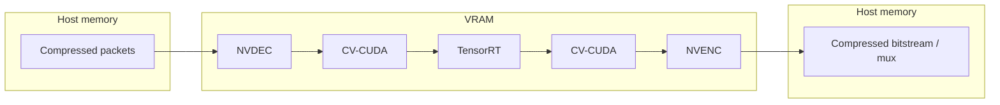
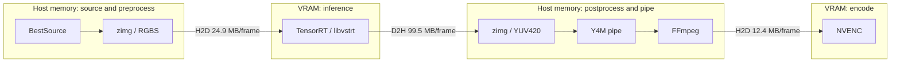

# Architecture

This document describes the internal architecture of `trtvideo`.
Public commands and model-preparation instructions are in
[`README.md`](../README.md), the testing strategy is in
[`TESTING.md`](TESTING.md), and measured performance results are in
[`PERFORMANCE_LOG.md`](PERFORMANCE_LOG.md).

## Project Scope

The project provides CLI tools for TensorRT-based video processing. Full-video
upscaling is currently implemented, while the structure allows additional
frame-local video workflows to be added later. Standalone image processing and
frame interpolation are outside the current scope.

The main component boundaries are:

```text
src/trtvideo/
  cli/          argument parsing and command entry points
  demo/         pinned quick-demo assets, orchestration, and media validation
  diagnostics/  opt-in stage timing and external profiler markers
  pipelines/    typed process configuration and production orchestration
  runtime/      TensorRT runtime and the common RuntimeEngine protocol
  video/        generic video metadata, frame iteration, and output contracts
    nvcodec/     NVDEC surfaces, CV-CUDA processing, and NVENC policy
    output/      preservation policy, FFmpeg muxing, and atomic publication
  models/       model runtime contract (ModelSpec)
```

The CLI does not discover models or engines automatically. The user explicitly
passes a static TensorRT engine through `--engine`.

## Inference Lifecycle

The `trtvideo` command maps CLI arguments into an immutable `ProcessConfig` and
creates the only production orchestrator, `NvcodecPipeline`:

1. Verify that `--engine` and `--input` exist.
2. Use the FFprobe adapter to read resolution, FPS, frame count, bitrate, and
   color metadata into `VideoMetadata`.
3. Reject inputs outside the current media contract.
4. Preflight source-stream compatibility with the selected output container and
   reserve a same-directory temporary output.
5. Load the selected engine into `CvcudaTensorRTRuntime` on the requested
   `--gpu-id`.
6. Validate the model contract and ensure that the video size matches the
   engine input shape.
7. Initialize NVDEC, NVENC, and reusable CV-CUDA buffers.
8. Process frames sequentially and collect statistics.
9. Flush the encoder, mux the result when required, and release resources.
10. Atomically replace the requested output only after every subprocess has
    completed successfully.
11. Print final throughput and an optional profile.

There is intentionally no abstract base pipeline. After removal of the former
CPU-frame backend, inheritance only hid the order of one concrete workflow and
made speculative extension points part of the production design. The stateful
`NvcodecPipeline` now owns orchestration and the frame loop directly, while
delegating cohesive policies to typed collaborators:

- `pipelines/config.py` owns validated process configuration and domain errors;
- `video/metadata.py` owns the normalized video metadata value object;
- `video/probe.py` adapts FFprobe output without terminating the process;
- `video/color.py` owns SDR metadata normalization and CV-CUDA/FFmpeg mapping;
- `video/output/` separates preservation preflight, streaming mux, and atomic
  output publication behind one stable package API;
- `diagnostics/profiling.py` owns isolated stage collection and report writing;
- `benchmarking/lifecycle.py` owns optional benchmark lifecycle markers.

This is composition around one real pipeline, not an abstraction for backends
that do not exist. A shared interface should be introduced only if a second
production implementation requires one.

## Model Contract And TensorRT Runtime

`CvcudaTensorRTRuntime` in
`src/trtvideo/runtime/cvcuda_tensorrt.py` owns the CV-CUDA tensors used by the
GPU-resident video path and does not import PyTorch. It:

- deserializes the TensorRT engine and creates an execution context;
- reads input/output tensor names, shapes, and data types;
- constructs `ModelSpec` and, before allocating buffers, verifies that the
  engine represents static, single-frame RGB upscaling with NCHW layout, batch
  size 1, and a uniform integer scale factor;
- supports FP32 and FP16 tensor bindings;
- preallocates and reuses `gpu_input` and `gpu_output`;
- binds them to the context with `set_tensor_address`;
- runs inference with `execute_async_v3` on a CUDA stream.

The runtime owns one `cvcuda.Stream` and passes its native handle to TensorRT
and NVENC. This places preprocess, inference, postprocess, and encode work on
one ordered GPU stream without host-side waits between stages.

The internal `TRTVIDEO_NVTX=1` diagnostic switch adds Nsight Systems ranges
around pipeline lifecycle and GPU stages. It is set only by benchmark
diagnostic tooling. Ordinary inference does not enter the per-stage NVTX path,
and Nsight collection is never part of a measured benchmark campaign.

A TensorRT engine depends on the TensorRT version and GPU architecture. Rebuild
the engine after changing to an incompatible TensorRT container or GPU class.
The `<engine>.json` sidecar stores build metadata but does not participate in
runtime discovery.

## GPU-Resident Video Pipeline

File: `src/trtvideo/pipelines/nvcodec.py`.

### trtvideo GPU-Resident Path



### VapourSynth Benchmark Path (As Measured)



The transfer labels are computed payload sizes for the declared FP32 RGBS and
YUV420 contracts at 1080p -> 4K. A measured SPAN 1080p Nsight trace found no
H2D or D2H copy in the `trtvideo` frame loop. Only compressed input and output
cross its host/device boundary.

> The source filter is configurable. NVDEC decoding is available to VapourSynth
> through DGDecNV, a closed-source AviSynth plugin made free on 2021-04-26 and
> distributed only for Windows as `DGIndexNV.exe` and `DGDecodeNV.dll`. It has no
> native VapourSynth integration and is loaded through an AviSynth compatibility
> layer. DGDecNV is absent from the pinned VSGAN image and the documented
> vs-mlrt workflow, and it cannot run in this benchmark's Linux containers. It
> would not remove the H2D and D2H transfers around inference: frames in a
> VapourSynth graph live in host memory regardless of where decode occurs.

```text
NVDEC -> NV12 GPU surface -> CV-CUDA RGB -> TensorRT
-> CV-CUDA NV12 -> NVENC -> H.264/HEVC pipe -> FFmpeg mux
```

Per-frame processing order:

1. `PyNvVideoCodec.ThreadedDecoder` decodes the compressed stream through NVDEC
   and returns an NV12 surface in device memory.
2. CV-CUDA wraps the decoded surface through its CUDA buffer interface. A
   zero-copy NHWC view crops any pitch padding without copying the frame.
3. `CvcudaFrameBuffers` and `CvcudaTensorRTRuntime` reuse preallocated RGB,
   NV12, and NCHW CV-CUDA tensors.
4. For limited-range input, CV-CUDA expands the Y and UV code ranges to full
   range on the GPU before converting NV12 to RGB with an explicit SDR color
   specification.
5. RGB is converted to the TensorRT input layout, then inference runs.
6. CV-CUDA converts the output RGB back to full-range NV12. Limited-range jobs
   compress Y and UV back to their video code ranges before encoding.
7. NV12 is passed to NVENC through PyNvVideoCodec.
8. NVENC writes H.264 or HEVC packets to a long-lived FFmpeg subprocess while
   frame processing continues. FFmpeg concurrently muxes the encoded video and
   all supported source non-video streams into the private output container.
9. In `finalize()`, the pipeline drains NVENC, closes FFmpeg stdin, and waits
   for container finalization, including MP4 `faststart` when applicable.

The production pipeline and trtvideo tensor-quality reference share
`NvcodecFrameProcessor` for surface wrapping, preprocess, TensorRT enqueue, and
postprocess. The quality job copies only selected normalized input and raw
output tensors to the host after synchronizing this shared path. External
inference parity then feeds exact copies of those input tensors into each
TensorRT graph; each implementation's normal decode/colorspace input is
captured separately as a non-gating preprocessing diagnostic.

Generic video concerns stay directly under `src/trtvideo/video/`:
`metadata.py` defines `VideoMetadata`, `probe.py` adapts FFprobe into that
contract, `fps.py` preserves rational frame rates, `frames.py` owns
implementation-independent iterator limits, and `color.py` owns the normalized
SDR conversion contract. The `output/` package separates preservation policy,
the long-lived FFmpeg mux process, and atomic publication. NVIDIA-specific
bitrate, decoder lifetime, encoder policy, CUDA surfaces, and frame processing
live under `src/trtvideo/video/nvcodec/`; its `frame_processor.py` is shared by
production and the tensor-quality reference capture.

The NVDEC surface handoff, CV-CUDA, TensorRT, and NV12 preparation explicitly
use the runtime CV-CUDA stream. Its native handle is passed to TensorRT and
NVENC. This preserves GPU operation order without a per-frame
`cudaStreamSynchronize`. PyTorch remains available for model export but is not
imported by ordinary video inference. The CPU remains the orchestration layer
and forwards the compressed bitstream through a pipe, but full frames do not
move between CPU and GPU. The pipeline does not create or reread a temporary
elementary-stream file.

NVENC uses no B-frames, preserves the source rational FPS, and creates a GOP/IDR
approximately once per second. This provides monotonic timestamps and a
seek-friendly output structure. Quality is controlled by an explicit
`--bitrate-mbps` value or by an automatic estimate derived from source bitrate:

```text
source_bitrate * (pixel_ratio * fps_ratio) ** 0.6
```

Automatic bitrate is a heuristic. Pass an explicit bitrate when reproducible
file size is required.

## Media And Color Contract

The current video path targets SDR 8-bit input. Shared validation rejects HDR
transfer functions and accepts only `yuv420p`/`nv12`. HDR, P010, YUV 4:2:2,
and YUV 4:4:4 require a separate color policy and tonemap.

When source metadata is absent, the pipeline uses safe SDR defaults: BT.709 for
HD/UHD and BT.601-compatible metadata for SD. CV-CUDA `AdvCvtColor` applies the
selected YUV matrix to full-range code values, so the pipeline explicitly
expands limited-range NV12 before RGB conversion and compresses the generated
NV12 before NVENC. Full-range input bypasses those range transforms. The output
receives populated `color_range`, `color_space`, `color_transfer`, and
`color_primaries` fields.

With `--max-frames`, output duration is limited using the exact FPS so audio
does not continue beyond the last processed video frame.

The pipeline uses one media-preservation contract:

- the enhanced stream replaces all source video streams;
- every source audio, subtitle, data, and attachment stream is stream-copied;
- global metadata, stream tags/dispositions, and chapters are retained;
- no incompatible stream is silently transcoded or dropped.

A short FFmpeg preflight runs before TensorRT initialization. If the selected
container cannot represent one of the copied codecs, the command fails and
recommends MKV rather than processing the video and failing during final mux.
When `--max-frames` is used, chapters are omitted because their original
timestamps can exceed the shortened output.

The final container is built at a same-directory temporary path. Successful
decode, encode, mux, and subprocess exit are required before `os.replace`
exposes it at the requested output path. Failure removes the temporary file and
does not overwrite an existing output.

## Profiling And Benchmarking

`--profile` enables `ProfileCollector` and measures:

- NV12 -> RGB through CV-CUDA;
- TensorRT inference;
- RGB -> NV12 through CV-CUDA;
- the NVENC encode call.

GPU stages are measured with CUDA events. After every profiled frame, the
runtime synchronizes its CUDA stream before committing the event intervals.
This deliberate frame-boundary barrier serializes the profiled path and
collapses the production path's cross-frame overlap between decode, CUDA work,
and encode.

The stage profiler starts after receiving a frame from the decoder and is not a
complete end-to-end process profile. It reports isolated stage costs under that
serialized schedule. The stage values must not be added together as a model of
real frame time, and the largest isolated stage may be hidden by overlap in the
normal path. Use the unprofiled benchmark for throughput and Nsight Systems for
pipeline overlap; stage-profiler results are not used for cross-product
comparisons.

The benchmark-image-only `benchmark-trtvideo` wrapper launches regular,
unprofiled `trtvideo` subprocesses: a discarded warmup followed by a measured
run. The external timer covers process startup, inference, encode, flush, and
mux. A parallel NVML sampler measures total GPU memory, power, utilization,
temperature, and throttle state without calls in the per-frame hot path. After
timing ends, the output is fully decoded and checked with FFmpeg/ffprobe, so
validation and hashing do not affect end-to-end FPS.

Project and VapourSynth runners share one measurement core for artifact
layout, warmup handling, process timing, child CPU accounting, NVML sampling,
output validation, reproducibility checks, and suite summaries. They retain
separate command builders and lifecycle adapters because the project emits
native frame markers while VapourSynth exposes progress and producer-exit
boundaries. The goal coordinator under `benchmarks/scripts/workflow/` reads a
strict workload/resolution matrix and expands `project`, `comparative`, `tuned`,
or `diagnostics` into ordered low-level Make targets. Successful high-level
steps are recorded against the exact repository revision, matrix hash, profile,
GPU id, and selected combinations, so resume skips only proven work.

Project, profile-specific comparative/tuning, and diagnostic evidence use
distinct artifact paths. `trtexec`, Nsight, and per-stage profiles remain
diagnostic and are never competitor rows.

The benchmark runtime is an optional Docker target. The production image
contains the main CLI, frame lifecycle marker emission, and reusable output
validation, but it does not install `nvidia-ml-py`, expose
`benchmark-trtvideo`, or copy the benchmark harness. Process orchestration,
NVML sampling, environment capture, suite policy, and evidence contracts live
under `benchmarks/scripts/`. Reproducible measurements use
`trtvideo:benchmark`.

## Static And Dynamic Shapes

The current video inference path is a static full-frame runtime: the engine
input shape must match the input video resolution.

Dynamic ONNX is supported at build time in two ways:

1. `prepare-onnx` creates static variants for specified resolutions.
2. `build-engine` accepts explicit `--min-shape`, `--opt-shape`, and
   `--max-shape` values.

A dynamic engine with an optimization profile can be built, but the current
runtime neither selects a concrete shape nor reallocates buffers. Therefore,
`trtvideo` requires a static engine.

With TensorRT 11, FP16 is defined by ONNX tensor types rather than weak-typing
builder flags. `prepare-onnx --precision fp16` converts internal floating-point
tensors to FP16 while retaining the FP32 I/O required by the current video
contract. `build-engine` then compiles the prepared ONNX without a separate
FP16 flag.

`export-onnx` validates graph generation before any engine is built. It runs a
small deterministic RGB tensor through the original Spandrel/PyTorch model and
an FP32 ONNX graph produced by the same export path, then enforces shape,
finite-value, RMSE, maximum-error, and PSNR limits. The source output determines
the uniform integer scale, and every full-size export must preserve it.
Successful evidence is bound to that scale, the checkpoint hash,
exporter/tool versions, and generated static FP32 ONNX hashes. This model-tools
operation is outside the production image and all performance timing.

## Known Limitations

- Only full-frame video upscaling with batch size 1 is implemented.
- Runtime dynamic-shape inference is not supported.
- The media contract is limited to SDR 8-bit video.
- Automatic bitrate does not guarantee a target file size or visual quality.
- The stage profiler deliberately synchronizes every frame. It provides
  isolated stage costs, not an additive decode-to-mux breakdown or a throughput
  measurement.
- TensorRT engines must be rebuilt after an incompatible TensorRT or GPU change.
